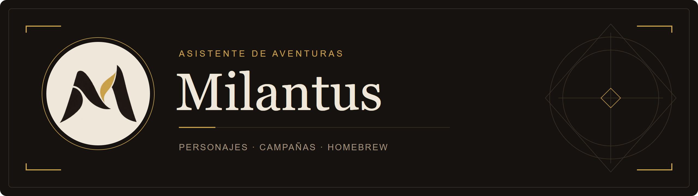
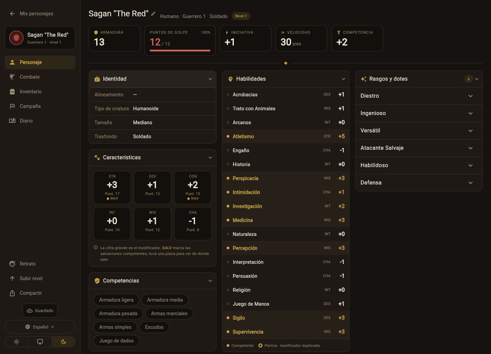
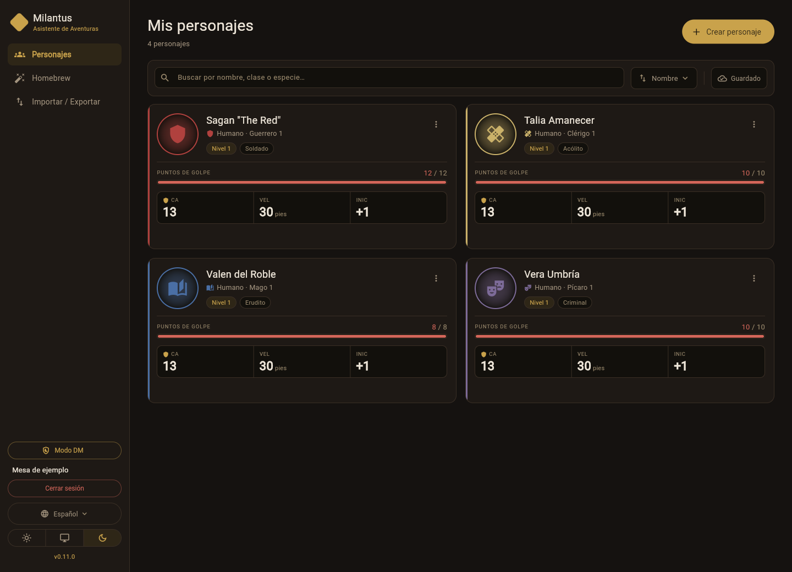
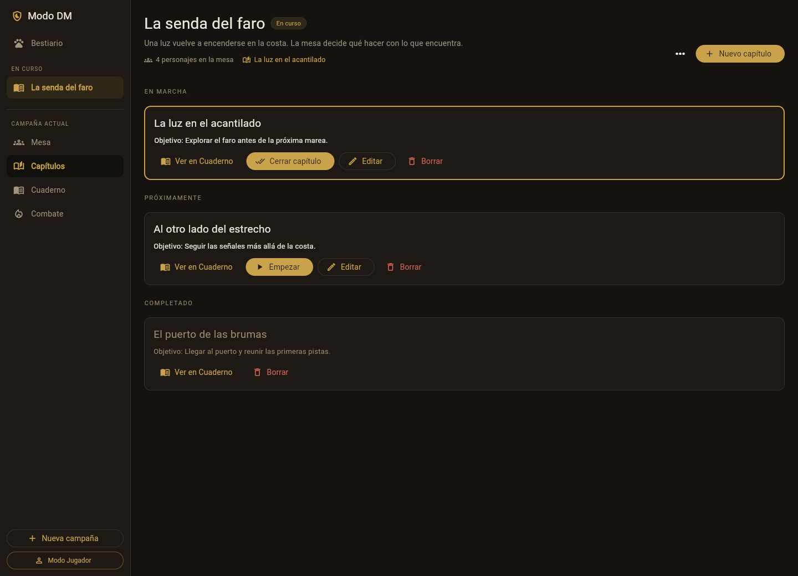

  

  <strong>Tus personajes. Tu mesa. La próxima aventura.</strong> 
  Creá personajes, combiná clases y dirigí campañas de D&D con las reglas de 2024, desde tu navegador.

  
  &nbsp; · &nbsp; Flutter Web &nbsp; · &nbsp; En español &nbsp; · &nbsp; Autoalojado

  <a href="#en-la-mesa">Funcionalidades</a> ·
  <a href="docs/README.md">Documentación</a> ·
  <a href="CHANGELOG.md">Novedades</a>

---

## La aventura sigue donde la dejaste

Milantus reúne fichas de personaje, herramientas para dirigir y contenido
propio en una misma aplicación web. Entrás con tu cuenta y recuperás tus
personajes, sus recursos y tus campañas desde cualquier navegador.

El motor resuelve modificadores, competencias, armadura, ataques y magia a
partir de tus elecciones. Si una elección no cumple los requisitos, te avisa
y te deja continuar: **la última palabra la tiene tu mesa**.

*Interfaz de Milantus con datos de demostración.*

## En la mesa

| Para tus personajes | Para dirigir la mesa | Para crear contenido |
| --- | --- | --- |
| Creación guiada y subida de nivel | Campañas, capítulos y cuaderno | Armas, armaduras y dotes |
| Multiclase y subclases por clase | Personajes compartidos por sus jugadores | Especies y trasfondos |
| Combate, conjuros y recursos | Bestiario y orden de iniciativa | Conjuros y criaturas |
| Inventario, retratos y respaldos | Registro de combates y avisos de recompensas | Opciones integradas con el catálogo |

### Tu personaje, de la primera tirada al próximo nivel

Elegí especie, trasfondo, clase, dotes y equipo con un asistente que muestra
las opciones de cada paso. Definí tus características por compra de puntos,
arreglo estándar o tiradas de 4d6.

Al subir de nivel, seguí con tu clase o sumá otra. Milantus combina rasgos y
competencias, calcula los espacios de conjuro y mantiene separados los de
Magia de Pacto. Antes de confirmar, revisás el resumen de los cambios.

Durante la partida llevás daño, curación, condiciones, concentración,
salvaciones de muerte y descansos desde la ficha. Podés cargar un retrato o
generarlo con los proveedores de IA disponibles en tu servidor.

### Detrás de la pantalla del DM

Con la misma cuenta, pasás de tus personajes a tus campañas. Organizá
capítulos, prepará encuentros con el bestiario y llevá turnos, rondas y puntos
de golpe de los monstruos. El cuaderno reúne tus notas y los combates cerrados.

Los jugadores comparten sus personajes mediante un código temporal. Ves la
ficha actualizada y cada jugador conserva el control de la suya. Al cerrar
un capítulo, podés anunciar nivel, oro y objetos para que cada participante
los incorpore a su personaje.

| Tus personajes | Tus campañas |
| --- | --- |
|  |  |

*Paneles con datos de demostración. Abrí cada imagen para verla en detalle.*

### Tus reglas también tienen lugar

El contenido homebrew queda en tu cuenta y aparece junto al catálogo en los
asistentes y las fichas. Usa el mismo motor de efectos que el contenido
incluido. Las criaturas propias también están disponibles en el bestiario;
vos decidís cuáles pueden utilizarse como formas de personaje.

<strong>También te acompaña entre sesiones</strong>

- **Personajes organizados:** búsqueda, criterios de orden, orden manual y un favorito
  destacado al principio de la lista.
- **La campaña desde tu ficha:** compañeros de mesa, combates registrados y
  capítulos completados, con sus recompensas anunciadas.
- **Respaldo y traslado:** exportación de personajes o un ZIP con fichas,
  retratos, homebrew y preferencias, sin credenciales. Al importar se
  conservan las fichas existentes; los identificadores repetidos se reasignan.
- **Continuidad de tus datos:** los formatos de personaje, homebrew y ajustes
  están versionados para migrar los documentos anteriores al abrirlos.

## Dentro del proyecto

| Paquete | Responsabilidad |
| --- | --- |
| [`dnd_app`](packages/dnd_app) | Cliente Flutter Web: fichas, asistentes y Modo DM. |
| [`dnd_engine`](packages/dnd_engine) | Motor en Dart: reglas, modelos y catálogo dirigido por datos. |
| [`dnd_server`](packages/dnd_server) | API con Shelf y PostgreSQL: sesiones, persistencia y permisos. |

El cliente y el servidor comparten el motor. Los cálculos de reglas viven en
`dnd_engine`; la interfaz presenta sus resultados. **Web es la plataforma
mantenida del cliente.**

<strong>Desarrollo local y verificaciones</strong>

Necesitás Dart y Flutter en el `PATH`, con las versiones compatibles que
declaran los `pubspec.yaml`. Ejecutá los comandos desde cada paquete:

| Directorio | Dependencias | Análisis y pruebas |
| --- | --- | --- |
| `packages/dnd_engine` | `dart pub get` | `dart analyze` y `dart test` |
| `packages/dnd_server` | `dart pub get` | `dart analyze` y `dart test` |
| `packages/dnd_app` | `flutter pub get` | `dart analyze` y `flutter test` |

Desde `packages/dnd_app`, generá el cliente con `flutter build web --release`.
Desde la raíz, instalá el hook de formato con
`git config core.hooksPath .githooks`. CI verifica formato, análisis y pruebas.

Las convenciones de trabajo están en [CLAUDE.md](CLAUDE.md) y la identidad
visual en la [guía de diseño web](docs/desarrollo/diseno-web.md).

## El camino recorrido

La versión **0.13.0** pule la llegada de alguien nuevo: un personaje de
ejemplo para recorrer la ficha, una creación de personaje que en el teléfono
lleva hasta cada elección y sugiere el reparto de puntuaciones de la clase,
textos unificados con el SRD en castellano y un arranque que tarda la mitad.

Consultá el [changelog](CHANGELOG.md) para conocer los cambios de cada versión
y el [índice de documentación](docs/README.md) para profundizar en arquitectura,
contenido y operaciones.

## Reglas y atribuciones

Esta obra incluye material procedente del documento de referencia del sistema
5.2.1 ("SRD 5.2.1") de Wizards of the Coast LLC, disponible en
[D&D Beyond](https://www.dndbeyond.com/srd). La licencia sobre el SRD 5.2.1 se concede de
acuerdo con la licencia internacional de atribución/reconocimiento 4.0 de
Creative Commons, disponible en
[su texto legal](https://creativecommons.org/licenses/by/4.0/legalcode).

El catálogo incluye además opciones del PHB 2024 y de *Forge of the Artificer*.
El contenido que no forma parte del SRD se identifica por separado y no se
presenta como contenido cubierto por esa licencia Creative Commons.
